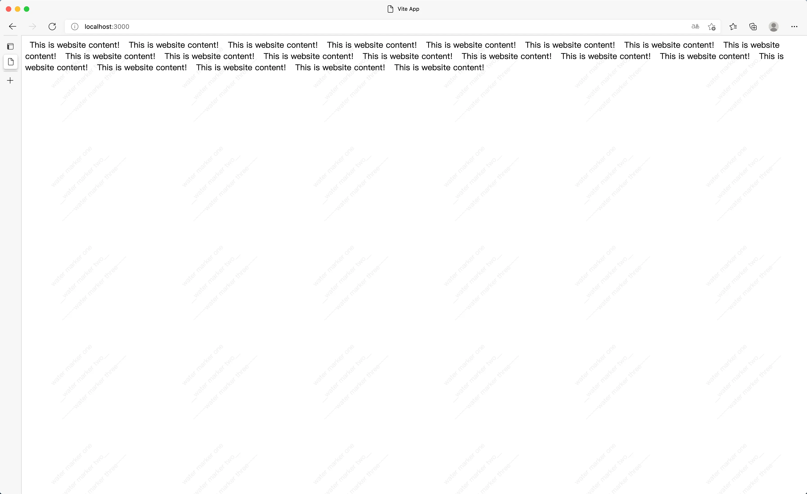

# vue-watermarker

English | [中文](./assets)

Cover the watermark on your website, which cannot be deleted or tampered with!



### Install

```shell
npm install vue-watermarker
// or
yarn add vue-watermarker
```

### Props
| props        | type        | default     | required      |    remark      |
| :------------: | :-----------: | :-----------: | :-----------: | :--------------: |
| content  |  string[]   |    []   |  Yes  |  Watermark content, supports html element  |
| visible  |  boolean    |   true  |  No  |  Dynamically create and destroy watermark components, created by default during initialization  |
|styleOption|   Object   |{fontSize: '15px',color: '#adadad',opacity: 0.2,textAlign: 'center'}|  No  |  Watermark style  |
|  width   |  number     |   220   |  No  |  The width of each watermark   |
|  height  |  number     |   220   |  No  |  Height of each watermark   |
|  refresh |  number     |   5000  |  No  |  The interval of refreshing the watermark can prevent the watermark from being tampered with, the unit is milliseconds, and it is recommended not to be less than 3000 milliseconds   |
|  target  |id\class\Node\Element|document.body|  No  |The parent element of the watermark|

### How to use

[Example](./example)

```vue
<template>
  <div>
    <span
      class="padding"
    >This is website content!</span>
  </div>
  
  <!-- waterMarker -->
  <VueWaterMarker
    :content="['water marker one', '__water marker two__', '~~~~~water marker three~~~~']"
  />
</template>

<script lang="ts">
import {defineComponent} from "vue"
import VueWaterMarker from 'vue-watermarker'
export default defineComponent({
  name: "App",
  components: {
    VueWaterMarker
  },
})
</script>

<style lang="scss" scoped>
.padding{
  font-size: 18px;
  padding: 10px;
}
</style>
```
