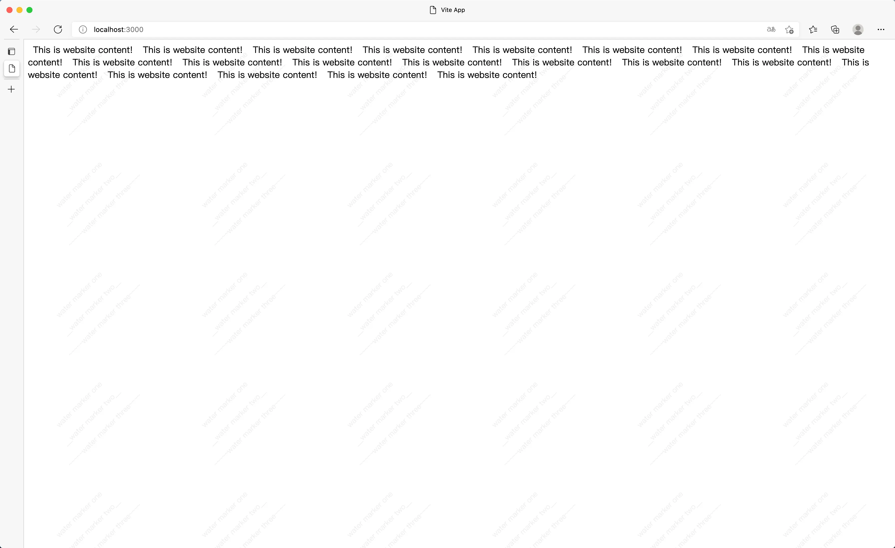

# vue-watermarker

[English](../) | 中文

在你的网站上覆盖水印，不可删除，不可篡改



### Install

```shell
npm install vue-watermarker
// or
yarn add vue-watermarker
```

### Props
| props        | type        | default     | required      |    remark      |
| :------------: | :-----------: | :-----------: | :-----------: | :--------------: |
| content  |  string[]   |    []   |  是  |  水印内容，一个元素显示一行，支持html元素  |
| visible  |  boolean    |   true  |  否  |  动态创建和销毁水印组件，初始化时默认创建  |
|styleOption|   Object   |{fontSize: '15px',color: '#adadad',opacity: 0.2,textAlign: 'center'}|  否  |  水印的样式  |
|  width   |  number     |   220   |  否  |  每个水印的宽度   |
|  height  |  number     |   220   |  否  |  每个水印的高度   |
|  refresh |  number     |   5000  |  否  |  刷新水印的间隔时间，可以防止水印被篡改，单位毫秒，建议不低于3000毫秒   |
|  target  |id\class\Node\Element|document.body|  否  |水印挂载的父元素|

### How to use

[Example](./example)

```vue
<template>
  <div>
    <span
      class="padding"
    >This is website content!</span>
  </div>
  
  <!-- waterMarker -->
  <VueWaterMarker
    :content="['water marker one', '__water marker two__', '~~~~~water marker three~~~~']"
  />
</template>

<script lang="ts">
import {defineComponent} from "vue"
import VueWaterMarker from 'vue-watermarker'
export default defineComponent({
  name: "App",
  components: {
    VueWaterMarker
  },
})
</script>

<style lang="scss" scoped>
.padding{
  font-size: 18px;
  padding: 10px;
}
</style>
```
